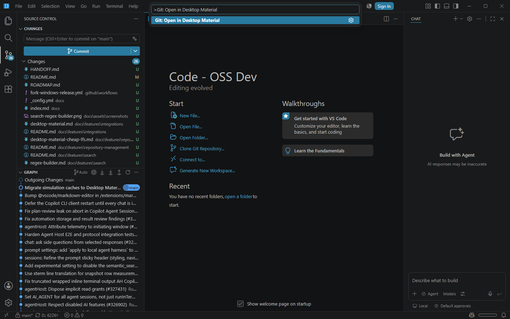

# Open in Desktop Material

The built-in Git extension contributes **Git: Open in Desktop Material**. It opens the currently selected Git repository in the Desktop Material desktop application without changing Git state or uploading repository data.



## Behavior

The command is available from the Command Palette and the quiet footer of the Git Source Control title and repository menus. VS Code passes the absolute root of the selected repository as one argument:

```text
--cli-open=<absolute repository root>
```

On Windows, automatic detection succeeds only when both of these branded-installation files are regular files below `%LOCALAPPDATA%\GitHubDesktop`:

```text
bin\desktop-material.bat
GitHubDesktop.exe
```

The batch file is a brand marker only. VS Code launches `GitHubDesktop.exe` directly with `shell: false`; it never executes `.bat` or `.cmd` files and never concatenates a shell command. The process is detached so VS Code does not wait for Desktop Material to close.

Successful launch, missing-installation, invalid-configuration, and process-start results use the workbench's localized, non-blocking notification UI. A failure notification offers a direct action to open the relevant setting. Desktop Material owns its persisted English, playful Hong Kong-style Cantonese, bilingual, and per-language funny-level presentation after launch.

## Configuration

`git.desktopMaterial.path` is an optional machine-scoped setting containing an absolute path to a direct executable. It is useful for a nonstandard Windows installation or a direct executable on another platform.

The setting rejects:

- relative paths;
- missing or non-file paths;
- Windows `.bat` and `.cmd` command scripts.

Leave the setting unset to use the branded Windows auto-detection described above.

## Failure modes

- **Not detected:** install Desktop Material or configure a direct executable.
- **Configured path is relative:** choose an absolute executable path.
- **Configured path is a command script:** point to a real executable; command-shell launch is intentionally unsupported.
- **Configured file is missing:** correct the setting after moving or uninstalling the application.
- **Spawn fails:** the Git output log records only a validated short error code, when available, and the workbench shows a generic persistent error notification. Raw operating-system error text and executable paths are not displayed.

No failure changes repository contents, staging state, branches, remotes, or credentials.

## Security and privacy

- The repository comes from the Git extension's selected `Repository` object, not editable command text.
- The path is a single child-process argument, including when it contains spaces or shell metacharacters.
- `shell: false`, ignored stdio, and direct executable validation prevent command-shell interpretation.
- VS Code does not transmit repository data. Desktop Material applies its own repository and Cheap LFS access controls after it opens.
- The configured executable is machine-scoped so a workspace cannot silently choose a program to run.

## Verification

Focused tests cover branded Windows detection, missing markers, non-Windows configuration, relative and command-script rejection, paths containing spaces, exact argv construction, `shell: false`, detachment, and process errors.

The 2026-07-26 local gate compiled the Git extension, passed targeted ESLint, and passed all six focused process-launch tests. A freshly isolated, trusted Code OSS Dev profile activated the built-in Git extension against this repository and exposed the command in the real Command Palette, as captured above.

The installed Desktop Material executable reports product version `3.6.3-beta3-zadtuyunxj`. It was launched on a separate headless desktop profile with `--cli-open` against an isolated acceptance clone, selected that exact clone, and its production log detected the `desktop-material/cheap-lfs/v1` pointers. The final public-clone materialization proof is tracked separately because a repository added locally to a signed-out profile has no GitHub Release account metadata.
