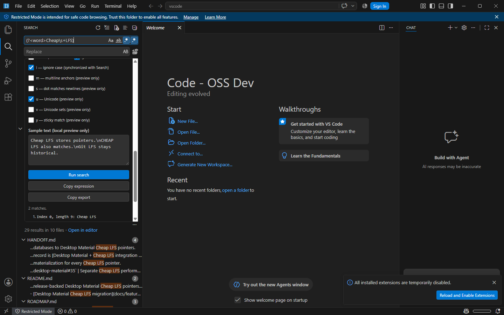

# Search regex builder

The Search view exposes a regex-builder button directly inside its query control. Plain-text search remains the default. Opening the builder never enables regex mode until the user deliberately selects it or inserts a regex building block.

## Behavior

The builder provides:

- literal escaping;
- character classes;
- start and end anchors;
- capturing and non-capturing groups;
- alternation;
- optional, zero-or-more, one-or-more, and bounded quantifiers;
- a raw pattern editor;
- supported JavaScript flags;
- bounded sample text;
- syntax feedback, live matches, numbered captures, and named captures;
- copy-expression and JSON export actions;
- a direct **Run search** action.

The raw pattern, regex mode, case sensitivity, and whole-word setting synchronize in both directions with the real Search query control. Flags that do not map to workspace Search stay in the builder and are labeled with their preview/export scope. **Copy expression** preserves the effective plain-text or regex semantics, while JSON export intentionally omits sample text.

## Engines and escaping

The local sample preview uses the runtime's JavaScript `RegExp` implementation (ECMAScript). Supported flags are detected at runtime from `d`, `g`, `i`, `m`, `s`, `u`, `v`, and `y`; `u` and `v` are mutually exclusive. The copy action converts plain text to a literal pattern when regex mode is off and uses `RegExp.prototype.toString()` to preserve slashes, line terminators, and flags in a usable `/pattern/flags` expression.

Workspace Search itself runs through VS Code's Search provider. The native provider passes regex queries to ripgrep with `--engine auto`, allowing ripgrep's default regex engine or PCRE2 as required. The JavaScript sample preview is therefore a local construction aid, not a promise that every engine-specific construct behaves identically. **Run search** is the authoritative workspace result, and the builder labels its JavaScript-only flags as preview/export-only.

## Bounds and failure modes

- Patterns are limited to 8 KiB.
- Sample text is limited to 64 KiB.
- At most 250 preview matches are rendered.
- At most 250 numbered-plus-named capture records are transferred and rendered; the status reports when further capture details were omitted.
- Evaluation starts after a short debounce in a disposable Web Worker.
- The workbench terminates an evaluation that does not return within 250 ms.
- Zero-width global or sticky matches advance by a Unicode code point to avoid an infinite loop.
- Invalid syntax and flags produce an inline, screen-reader-announced status.
- Worker startup or execution failures leave Search usable and report a local preview error.

Patterns and sample text remain local to the workbench. They are not sent over the network and sample text is not persisted or included in exports.

## Accessibility and layout

The builder is a named region with native labels and fieldsets, keyboard-reachable controls, visible token-based focus indicators, a polite live status, and an Escape close path that returns focus to Search. The toolbar button participates in the existing Search tab order. Controls wrap at narrow widths, the panel owns bounded scrolling, and long matches wrap rather than clip.

Color, typography, spacing, shape, and focus treatment use workbench design tokens, so light/dark themes, user font choices, zoom, high-contrast themes, and density changes remain inherited from the host.

## Verification

Unit coverage includes valid and invalid patterns, duplicate/unsupported flags, no-match behavior, literal-versus-regex copy behavior, slash escaping, flags, Unicode, multiline matching, zero-width matching, numbered and named captures, guided insertion with synchronous Search-state echo, size limits, the match cap, and the aggregate capture-record cap. Compilation covers the Web Worker entry point and Search integration. Isolated headless workbench acceptance should additionally verify the toolbar entry, narrow layout, keyboard path, live result status, and synchronization with the actual Search query.

The 2026-07-26 acceptance run passed client typechecking, targeted ESLint and style checks, and 19 focused regex-builder tests. A freshly isolated Code OSS Dev profile then exercised the real Search view entirely on a headless desktop: `(?<word>Cheap\s+LFS)` produced two local matches, displayed the named capture, synchronized regex/case state, and drove a real workspace search reporting 29 results in 10 files. The 400-pixel Search view remained keyboard operable with no clipped controls; the screenshot above is from that built workbench.
