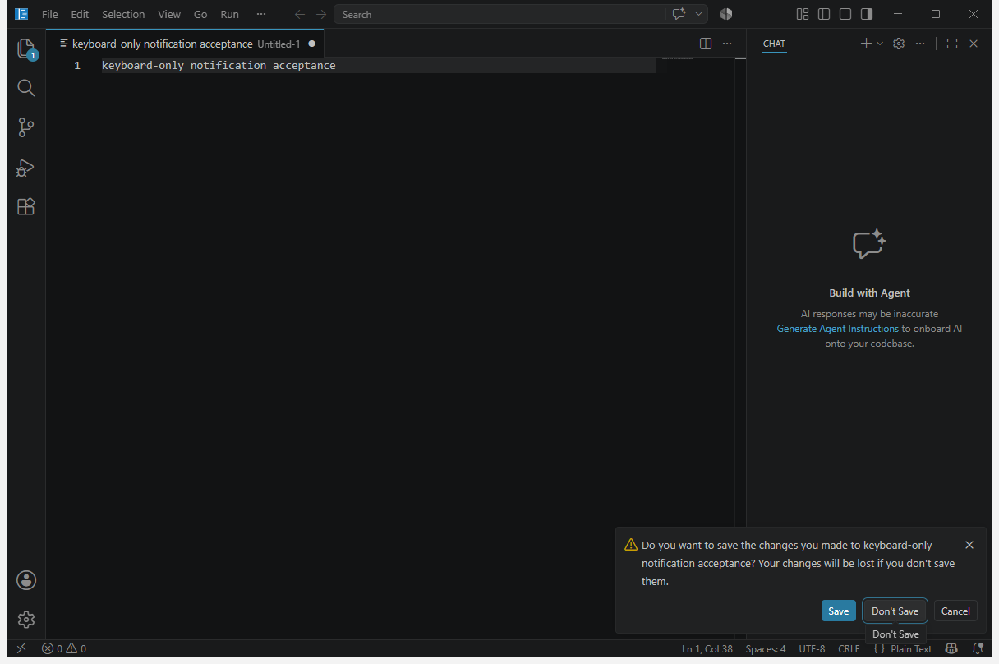
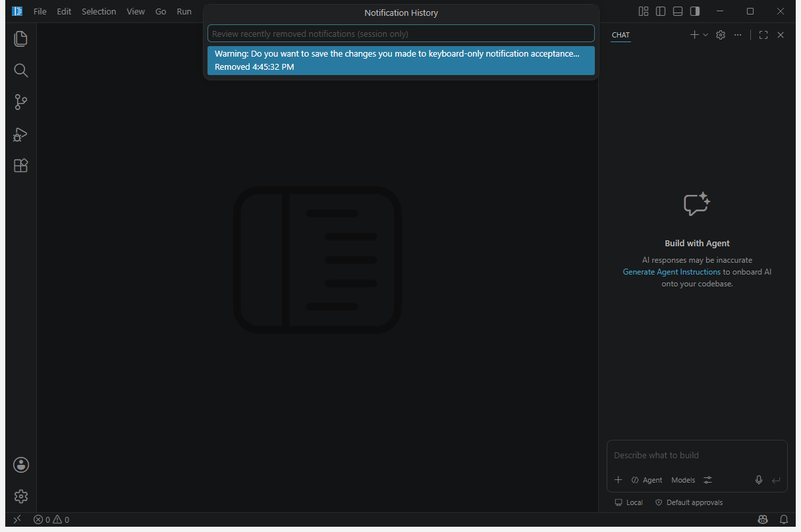

# Keyboard-first dialog notifications

On desktop, this fork defaults `window.dialogStyle` to `notification`. Confirmations and prompts appear as actionable workbench notifications instead of blocking the entire window. The operation that requested a decision still waits for an explicit result, while unrelated workbench commands remain available.

## Behavior

- Actionable decisions are sticky, urgent notifications and move keyboard focus to the notification actions. If a toast is unavailable because the Notification Center is open or burst protection suppressed it, the center opens and focuses the newest decision instead.
- Dismissing a normal decision or cancelling its token selects the existing cancel path exactly once; no positive action is chosen automatically. Decisions marked as non-dismissible are re-presented after a close attempt until an explicit action or cancellation token resolves them.
- Buttonless information resolves immediately. Warnings and errors remain until dismissed.
- Checkbox state is exposed as a keyboard action and repeated in the notification text as enabled or disabled.
- Multi-field text entry uses ordered Quick Input steps. Password fields use Quick Input's masked password mode.
- Cancelling text entry returns a cancelled result without applying partial input.
- The About interaction provides keyboard-reachable **Copy** and **OK** actions.
- The Notification Center exposes a bounded history of the 50 most recently removed notifications in the current window. History stores display text, severity, source, and removal time only; it never retains actions, error objects, progress state, link targets, or command URIs.

## Configuration

`window.dialogStyle` is an application-scoped setting:

| Value | Behavior |
| --- | --- |
| `notification` | Keyboard-focusable, non-modal notification actions. This fork's default. |
| `custom` | The existing custom workbench modal dialog. |
| `native` | The operating system's native modal dialog. |

The smoke-test driver deliberately uses the custom dialog so existing automation can interact with a deterministic surface. Notification style currently applies to the Electron desktop workbench; web and mobile workbenches retain their existing dialog handlers.

Use **Notifications: Show Notification History** to review removed items and **Notifications: Clear Notification History** to clear them. History is memory-only for the current window and is never written to disk, Settings Sync, or telemetry.

## Safety and failure modes

- Unsaved-file, destructive, authentication, consent, trust, and extension-security operations still wait for an explicit result.
- Native open and save file pickers are separate from `window.dialogStyle` and remain native.
- Credential values are masked while typed and are not logged by the notification handler. Their caller retains responsibility for optional storage.
- Closing a notification is cancellation, not confirmation.
- Asynchronous action failures propagate to the operation that requested the decision.
- Custom button details are included in the screen-reader-visible notification body beside their action names, while the button labels stay short enough for the toast action row. Markdown is rendered into notification-safe text: web and file links remain available, command links require the Markdown trust flag or `enabledCommands` allowlist, and links with custom action handlers become plain text. Custom dialog classes and icons require `custom` dialog style.
- A notification filtered by Do Not Disturb is still shown when it represents an awaited decision because decision notifications use urgent priority.

Electron surfaces that cannot safely reach a running workbench remain explicit exceptions: native open/save/folder pickers; credential, permission, consent, destructive quit, and unsaved-changes gates; fatal or startup failures shown before a renderer exists; and specialized progress or multi-step custom surfaces that require live body controls. Current direct progress-dialog users include the shutdown-joiner barrier, trace-file creation, and remote-reconnection status. These exceptions remain blocking by design and are not described as notification-routed.

## Accessibility

Notification actions use the workbench's existing keyboard-focus, screen-reader announcement, severity, contrast, and focus-ring behavior. Mnemonics are normalized for notification labels, checkbox state is represented in text, and Quick Input supplies titles, placeholders, ordered step counts, and password semantics without requiring pointer input.

## Verification

`src/vs/workbench/test/browser/parts/dialogs/notificationDialogHandler.test.ts` covers confirmation actions, unclipped accessible action details, toast-to-center focus fallback, checkbox state, dismissal, non-dismissible decisions, asynchronous prompt results, custom cancellation, cancellation tokens, trusted and untrusted Markdown links, immediate information, persistent warnings, ordered inputs, password masking, partial-input cancellation, About-copy behavior, render-frame focus timing, and suppression of modal lifecycle events. Core notification tests cover inert bounded history, dedup suppression, ordering, eviction, and clearing.

On 2026-07-26, an isolated headless Windows desktop opened a dirty untitled editor in a fresh profile. Closing it produced the notification above; focus moved from the editor to the notification container after rendering, two **Tab** presses selected **Don't Save**, and **Enter** completed the decision without pointer input or an extra editor edit. The same run opened the history command and found the inert removed decision. Native file pickers remain separate, while custom and native dialog styles remain available for compatibility testing.
