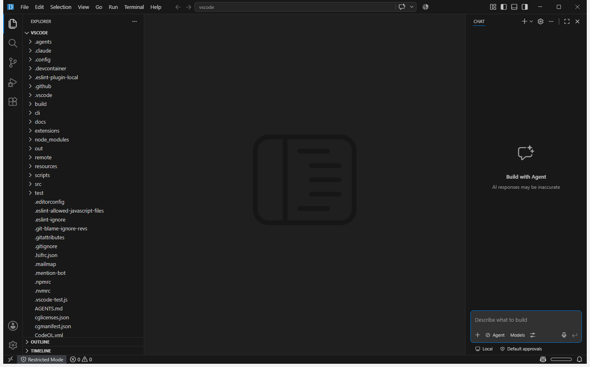

# Quiet workbench defaults

New profiles start without unsolicited onboarding, recommendations, surveys, experiments, or release-note editors. Every behavior remains configurable; an explicit existing user or workspace setting continues to win over the fork default.

## Defaults

| Setting | Fork default | Effect |
| --- | --- | --- |
| `workbench.startupEditor` | `none` | Does not automatically open Welcome in a new empty workbench. |
| `workbench.welcomePage.experimentalOnboarding` | `false` | Does not start experimental first-run onboarding. |
| `workbench.welcomePage.walkthroughs.openOnInstall` | `false` | Does not automatically open extension walkthroughs after installation. |
| `extensions.ignoreRecommendations` | `true` | Suppresses extension-recommendation notifications. |
| `workbench.tips.enabled` | `false` | Hides empty-editor watermark tips. |
| `chat.tips.enabled` | `false` | Hides unsolicited contextual tips above chat messages. |
| `chat.titleBar.signIn.enabled` | `false` | Hides the signed-out title-bar prompt while retaining the status-bar sign-in entry. |
| `github.copilot.chat.surveys.enabled` | `false` | Does not schedule recurring Copilot survey invitations unless explicitly enabled. |
| `update.showReleaseNotes` | `false` | Does not automatically open release notes after an update. |
| `workbench.enableExperiments` | `false` | Does not fetch or apply experiment assignments unless enabled. |
| `security.workspace.trust.banner` | `never` | Hides the persistent Restricted Mode banner. |
| `security.workspace.trust.untrustedFiles` | `newWindow` | Opens untrusted files in a separate restricted-mode window without prompting. |

`security.workspace.trust.startupPrompt` remains `never`. Workspace Trust itself remains enabled.

## Safety and overrides

Quiet defaults suppress automatic presentation; they do not grant trust or approve a security decision. Untrusted files remain isolated in a Restricted Mode window, and the restricted-mode status-bar entry remains available. Authentication, permissions, destructive decisions, errors, Welcome, walkthroughs, release notes, recommendations, experiments, and surveys remain discoverable through their commands, views, and settings.

The explicit `--skip-welcome` startup flag returns before restored walkthrough processing, so automation and deliberate quiet launches cannot be overridden by persisted walkthrough state. A walkthrough that the user intentionally opened may otherwise be restored after reload.

To restore upstream-style behavior, change any individual setting in the Settings editor or `settings.json`. Copilot surveys are opt-in independently of issue reporting and other feedback commands.

## Failure modes and privacy

- Existing explicit profile settings are not rewritten, so an older profile can retain upstream values until the user changes them.
- `newWindow` requires the desktop host to create a separate Restricted Mode window; a host failure is reported as an error notification.
- Survey suppression stops usage tracking performed solely for survey eligibility and does not persist a hidden opt-in value.
- Disabling experiment assignment prevents online treatment fetches but does not disable stable product functionality.

## Verification

Verification uses configuration-source assertions plus a new isolated desktop profile. On 2026-07-26, a fresh profile opened this repository directly in Restricted Mode with no Welcome editor, onboarding, Workspace Trust prompt or banner, recommendation prompt, chat tip, title-bar sign-in prompt, release notes, or survey invitation. The Restricted Mode status entry remained visible, proving the quiet presentation did not grant trust.
